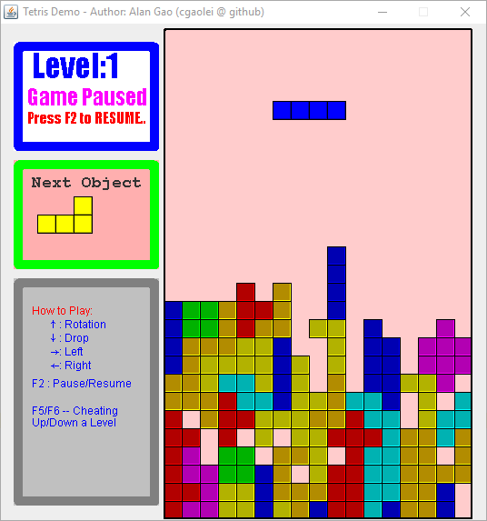

# Tetris

While cleaning up old hard drives and found a Tetris demo game written in old school age. 

It was originally open sourced in 2009 at https://cgaolei.iteye.com/blog/411861 (Github was not existed)

It demonstrate the basic idea of Tetris game model.

Download and rum from the [release page](https://github.com/cgaolei/tetris/releases).

>无意中翻出了学生时代写的一个俄罗斯方块的游戏。
>
>记得是个周末写的，从头到尾用了两天，基本定型了，之后又稍作修改。
整个程序完全使用AWT画图，没有图片资料。声音文件来自互联网。
>
>公开源代码，供初学者学习。 

